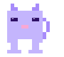

  

 

  
  &nbsp;
  

 

## 👾 Sobre Mim

  

🎓 &nbsp;**Instituto Federal Catarinense** &nbsp;·&nbsp; Campus Araquari &nbsp;·&nbsp; Sistemas de Informação &nbsp;·&nbsp; 3º Sem.

 

💡 &nbsp;Apaixonado por lógica, backend e sistemas &nbsp;·&nbsp; Cada projeto nasce de uma ideia real.

 

🔧 &nbsp;Desenvolvimento fullstack com foco em &nbsp;**JavaScript, Python, HTML e CSS**.

 

🌱 &nbsp;Evoluindo continuamente &nbsp;—&nbsp; *"A melhor versão de mim está sendo escrita agora."*

 

🚀 &nbsp;Transformando aprendizado em soluções reais e projetos impactantes.

 

## 🛠️ Stack Tecnológica

 

  

<table>
  <tr>
    <td align="center">
      
    </td>
    <td align="center">
      
    </td>
    <td align="center">
      
    </td>
    <td align="center">
      
    </td>
  </tr>
</table>

## 🚀 Projetos em Destaque

 

  

<h3>🛡️ SafeWay &nbsp;—&nbsp; Frete com Credibilidade</h3>

Plataforma de logística rodoviária focada em <strong>segurança</strong>, <strong>credenciamento</strong> e <strong>confiança</strong> entre motoristas autônomos e empresas embarcadoras.

<em>Iniciado no <strong>Startup Weekend 2026</strong> — evoluindo para produto real.</em>

 

  

| Fase | Descrição | Status |
|:----:|-----------|:------:|
| 1 | Frontend estático completo | 🔲 Concluído |
| 2 | Backend Node.js + banco de dados | 🔲 Concluído |
| 3 | Integração frontend ↔ backend | 🔲 Concluído |
| 4 | Credenciamento real (APIs gov) | 🔲 Planejado |
| 5 | Deploy — Vercel + Railway | 🔲 Planejado |

 

&nbsp;

&nbsp;

  

 

## 📊 GitHub Analytics

 

&nbsp;

  

  

## 📬 Contato

 

&nbsp;

&nbsp;

  

> *"A jornada de mil commits começa com um único `git init`."*

 

 

