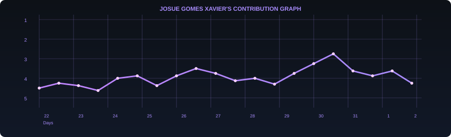

  

 

  
  &nbsp;
  

 

## 👾 Sobre Mim

  

🎓 &nbsp;**Instituto Federal Catarinense** &nbsp;·&nbsp; Campus Araquari &nbsp;·&nbsp; Sistemas de Informação &nbsp;·&nbsp; 3º Sem.

 

⚡ &nbsp;Apaixonado por esportes e tecnologia.

 

🌱 &nbsp;Sonho em criar algo que realmente faça diferença para as pessoas.

 

## 🛠️ Stack Tecnológica

 

  

<table>
  <tr>
    <td align="center">
      
    </td>
    <td align="center">
      
    </td>
    <td align="center">
      
    </td>
    <td align="center">
      
    </td>
  </tr>
</table>

## 🚀 Projetos em Destaque

 

  

<h3>💈 Nascimento Barber</h3>

Projeto real, desenvolvido para a barbearia do <strong>Lucas Nascimento</strong>, meu barbeiro — construído com <strong>Claude Code</strong>, com foco total em ficar 100% no plano free de todos os serviços, custando apenas <strong>R$ 40</strong> no total: o registro do domínio <strong>nascimentobarber.com</strong>.

 

| Área          | Stack                                 |
| :-----------: | -------------------------------------- |
| Frontend      | Next.js 16 + React 19 + Tailwind CSS  |
| CMS           | Sanity                                |
| Banco / ORM   | PostgreSQL + Prisma                   |
| Autenticação  | NextAuth.js (Auth.js) + bcryptjs      |
| E-mail        | Resend                                |
| Monitoramento | Sentry                                |
| Testes        | Vitest                                |

  

 

## 📊 GitHub Analytics

 

&nbsp;

  

  

## 📬 Contato

 

&nbsp;

&nbsp;

  

> _"A jornada de mil commits começa com um único `git init`."_

 

 

